# SDP + Lakebase Realtime Segmentation Test

## Slide 1: Architecture Tested

**Goal:** Evaluate realtime segment qualification using Spark for rule evaluation and Lakebase for low-latency serving.

```mermaid
flowchart LR
  A[Tealium events<br/>Azure Event Hub] --> B[Lakeflow SDP<br/>Parse + filter events]
  B --> C[Delta table<br/>tealium_eventhub_events]
  C --> D[SDP Spark evaluation<br/>Reverse-index candidate segments]
  D --> E[Delta table<br/>evaluated_realtime_memberships]
  E --> F[Auto CDC SCD Type 1<br/>latest profile-segment state]
  F --> G[Delta table<br/>membership_flags_current]
  G --> H[Lakebase synced table<br/>continuous sync]
  H --> I[Postgres serving table<br/>profile -> active segments]
```

**Runtime configuration tested**

- Lakebase endpoint: 24 CU min / 32 CU max
- SDP pipeline: serverless continuous
- Lakebase synced table: continuous sync from UC current-membership table
- Table layout: liquid clustering on run/profile and profile/segment keys
- Predictive optimization enabled on `main.cdp_rt_sim`

---

## Slide 2: Performance And Cost Results

**Clean run:** `sdp_clean_1788233105`

| Metric | Result |
|---|---:|
| Generator duration | 30 minutes |
| Events generated | 2.841M |
| Events accepted by SDP | 2.462M |
| Segment evaluation rows | 172.357M |
| Current membership rows in Delta | 111.471M |
| Rows synced to Lakebase/Postgres | 111.471M |
| Read-path test | 90,000 reads, 0 errors |
| Read latency | 4.46 ms average |

**Observed freshness**

- Parsed event table stayed near realtime: ~3-5 seconds lag late in run
- Evaluated membership table stayed near realtime: ~12 seconds lag late in run
- Current membership Delta lag grew under load: ~3 minutes mid/late run
- Postgres synced table lag grew under load: ~11 minutes mid-run
- Postgres caught up fully after generation stopped

**Measured list-price cost**

| Component | DBU / Usage | List Cost |
|---|---:|---:|
| SDP evaluation pipeline | 6.68 DBU | $3.01 |
| Lakebase synced-table pipeline | 6.35 DBU | $2.86 |
| Lakebase endpoint compute | 6.11 DBU | $1.59 |
| Lakebase storage during window | storage usage | $0.04 |
| **Measured runtime total** | **19.14 compute DBU + storage** | **$7.49** |

**Unit cost from this stress run**

- $3.04 per 1M accepted events
- $2.64 per 1M generated events
- $0.043 per 1M evaluated rows
- $0.067 per 1M current membership rows

---

## Slide 3: Learnings

**What worked**

- Spark/SDP evaluation path stayed close to realtime even during the high-volume run.
- Lakebase synced tables worked end-to-end from the Auto CDC current-membership Delta table.
- Final Postgres row count caught up exactly to UC current membership: 111.471M rows.
- Serving reads from Lakebase were fast during the test: 4.46 ms average, 0 errors.

**Main bottleneck**

- The workload created very high fanout.
- Current simulation used 800 segments over only 4 realtime behavioral traits.
- That produced roughly 308 candidate evaluations per fully evaluated event.
- The high row volume made Auto CDC current-state maintenance and Lakebase sync the dominant latency sources.

**Why production should be better**

- Customer profile has ~400-450 attributes; likely ~50 behavioral traits from Tealium.
- If 800 segments are spread across 50 behavioral traits, candidate fanout is closer to:
  - 800 / 50 = 16 segments per trait
  - ~1.5 traits touched per event = ~24 candidate evaluations per event
- That would reduce evaluated/current/synced rows by roughly an order of magnitude versus this stress test.

**Recommended next test**

- Re-run with ~50 behavioral traits and a realistic skew model:
  - many low-cardinality traits with small segment fanout
  - a few hot traits with higher fanout
  - target 30-50 candidate segment evaluations per event
- Measure the same stages separately:
  - Event Hub to parsed Delta
  - parsed Delta to evaluated Delta
  - evaluated Delta to current-membership Delta
  - current-membership Delta to Lakebase/Postgres
